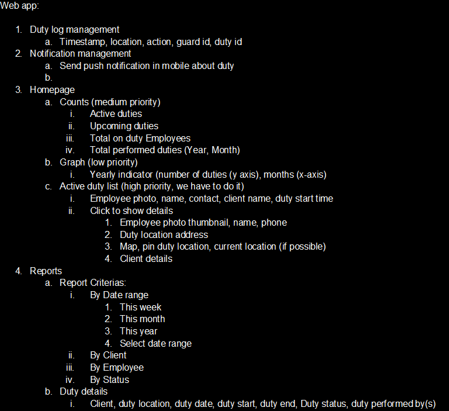
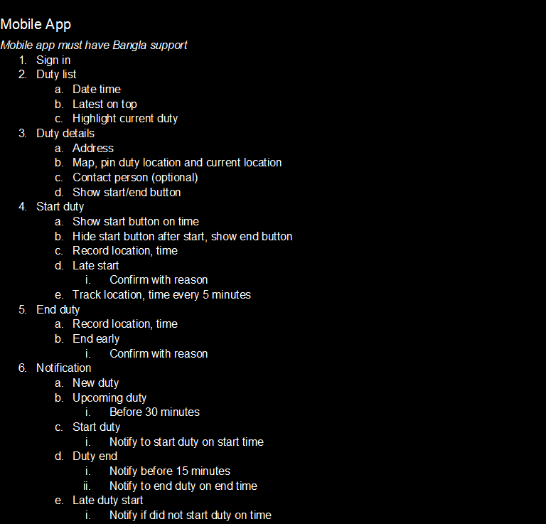
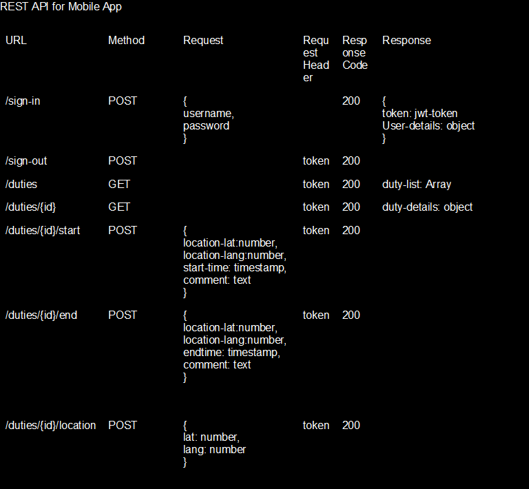

# Employee_Duty_Management OR Field_Worker_Management

# Using: 
* Build tool - Maven, 
* Spring Validation, 
* Spring Security, 
* Thymleaf Template Engine,
* Bootstrap, 
* JWT, 
* Enum, 
* Custom Exception Handling, 
* Pagination, 
* Rest API (Field worker Mobile login).

## Client

## Employee

